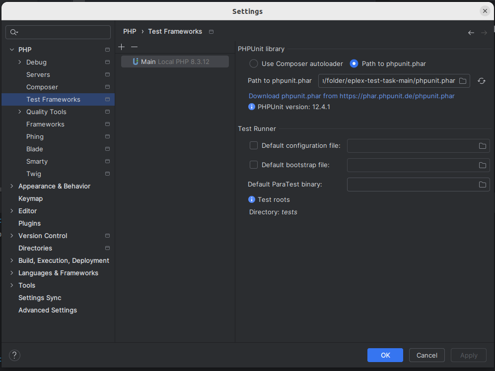
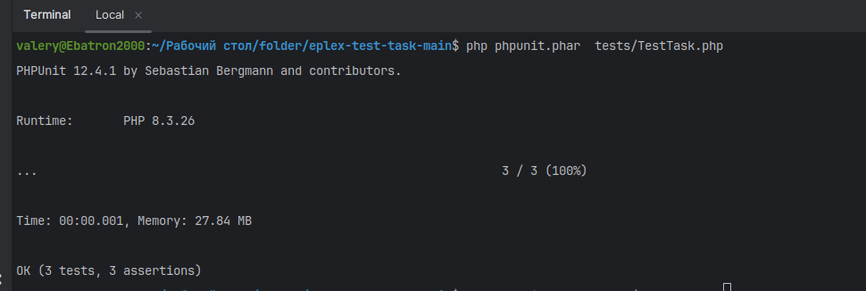

## Установка приложения

```
git clone https://github.com/worldWarmWorm/eplex-test-task.git
```

## Настройка phpunit в IDE



## Запуск тестов в корне проекта

```
php phpunit.phar  tests/TestTask.php
```

## Результат

